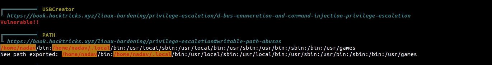

# passage-htb

Эхлээд ороход онцын зүйлгүй веб угтах бөгөөд эндээс "Source Code" анализ хийж үзвэл "CuteNews" гэх "Directory" байгаа нь анзаарагдав

.png>)

.png>)

Тухайн "Directory"-луу орж үзвэл "Login Page"-рүү үсэрч, тухайн ажилж буй "Service"-ийн "Version"-ийг харвал "CuteNews 2.1.2" гэх бөгөөд "Vuln Machine" юм хойно "CVE" байгаа байх гээд хайж үзтэл үнэхээр байж байв

.png>)

.png>)

Гэхдээ "Writeup" учир гараар хийж үзүүлвэл арай хүртээлтэй байх гээд хэрхэн хийж байгааг бичив.

Мэдээж хамгийн түрүүнд "Register" хийх нь ойлгомжтой бөгөөд хийж үзвэл өнөөх "Service" ийнхээ "Dashboard"-руу оров ганц сонголт нь "Personal Options" учир орж үзвэл өөрийн "Avatar-аа Upload" хийх сонголт гарч ирнэ эндээс хортой "File" оруулж "Reverse Shell" үүсгэх боломжтой бөгөөд мэдээж бодит орчинд энэ нь бараг л боломжгүй. Энд ажилж байгаа шалтгаан нь авж байгаа зургаа бараг л "Filter"-гүй авж байгаа болон өөрийн байршуулсан "File"-руугаа хүссэнээрээ хандаж болж байгаад л юм.(ᵔ◡ᵔ)

.png>)

.png>)

Юун түрүүнд хортой зургаа бэлдэнэ "PHP Reverse Shell"-ийн "Header"-ийг "GIF"-ээр солив энэ нь хамгийн хялбар энгийн арга бөгөөд ихэнхдээ ажилчихдаг юм дөө xD.

Мэдээж шууд "Upload" хийвэл "Content-Type" нь таарахгүй бөгөөд "File"-аа "GIF" болгон дундаас нь "Burp"-ээр "File Type"-аа солиход хангалттай юм.

.png>)

.png>)

Эндээс хаашаа "Upload" хийгдсэн нь харагдах бөгөөд орж үзвэл "Shell" маань амжилттай орсон байна. Одоо харин "Reverse Shell" үүсгэцгээе.

.png>)

.png>)

Амжилттай "Reverse Shell" үүсгэсэн ч "www-data user"-ээр л оров юун түрүүнд "Linpeas" ажлуулж үзэн хэд хэдэн горьдлого төрүүлэхүйц Exploit гэх мэт зүйлс олсон ч бүтэлгүйтэв нуршаад яахав гээд дурдалгүй өнгөрье. Найдлага тасрахын даваан дээр "Google"-дэж яваад  хэрэглэгчидийн "Password" хадгалж байдаг "File" байдгийг мэдэв.

.png>)

.png>)

"Find" коммандаар амархаан олоод хартал онц юм байсангүй харин байрлаж байсан "Directory" доторхыг нь сонирхвол ＼(≧▽≦)／&#x20;

эцэст нь гаргалгаа олов. "users" гэх "Directory" байх бөгөөд харвал хэрэглэгч тус бүрийн мэдээллийг "Base-64"-өөр "Encode" хийн "File" тус бүрт хадгалсан байв.

.png>)

.png>)

.png>)

Даанч пассворд нь шууд ил байгаагүй бөгөөд харвал "Hash"-лагдсан байгаа нь тодорхой тиймээс хэрэгтэй хэдэн хэрэглэгчидийнхээ "Hash"-ийн "Crack" хийх хэрэгтэй авсан "Shell"-ээсээ "cd /home; ls" эсвэл зүгээр "cat /etc/passwd" гээд амархан хэрэглэгчээ мэдчихэж болно.

.png>)

2 хэрэглэгчийнхээ "Hash" ийг аван "Online Hash Identifier" хэрэглэхэд "sha256" байх бөгөөд "Crack" амжилттай болж "Paul"-ийн пассвордыг олов харин "Nadav"-ийн "Hash" "Crack" хийгдсэнгүй.

.png>)

Yay we got user.txt :tada::tada::tada:

Багахан "Enumeration" хийгээд нөгөө хэрэглэгчээрээ орж байж "root"-ээ авахаас гарцаагүй дээр тулав. "Shell"-ээ "Reverse Shell"-ээр авсан учир холболт салах зэрэг нь амархан байсан болохоор "ssh" ээр орохоор шийдэж "Username, Password"-оороо орох гэтэл "RSA" нэхэв. Мэдээж нэгэнт хэрэглэгчээрээ орчихсон болохоор энэ нь нээх асуудал биш байв харин "RSA"-ээ авах гээд хартал "Paul"-ийх биш өнөөх "Nadav"-ийн "RSA" явж байв энгийн Shell дээрээ яваад байсан бол яах ч байсан юм байгаан (ﾉಥ益ಥ)ﾉ &#x20;

\>Яагаад энд явж байгааг нь тайлбарлаж мэдэхгүй нь судлаад мэдвэл нийтлэлээ янзалнаа баярлалаа.

.png>)

.png>)

"Last Boss" буюу "Root"-рүү "Privilage Escalation" хийх нь санасныг бодвол гайгүй амархан байв.

Уламжлал ёсоор "Linpeas" ажлуулхад хэрэгтэй зүйлийг минь гаргаж өгсөн бөгөөд бэлэн "Payload" ажлуулвал ингээд "Flag"-аа авж байна.

`gdbus call --system --dest com.ubuntu.USBCreator --object-path /com/ubuntu/USBCreator --method com.ubuntu.USBCreator.Image /root/root.txt ~/root.txt true`

.png>)
